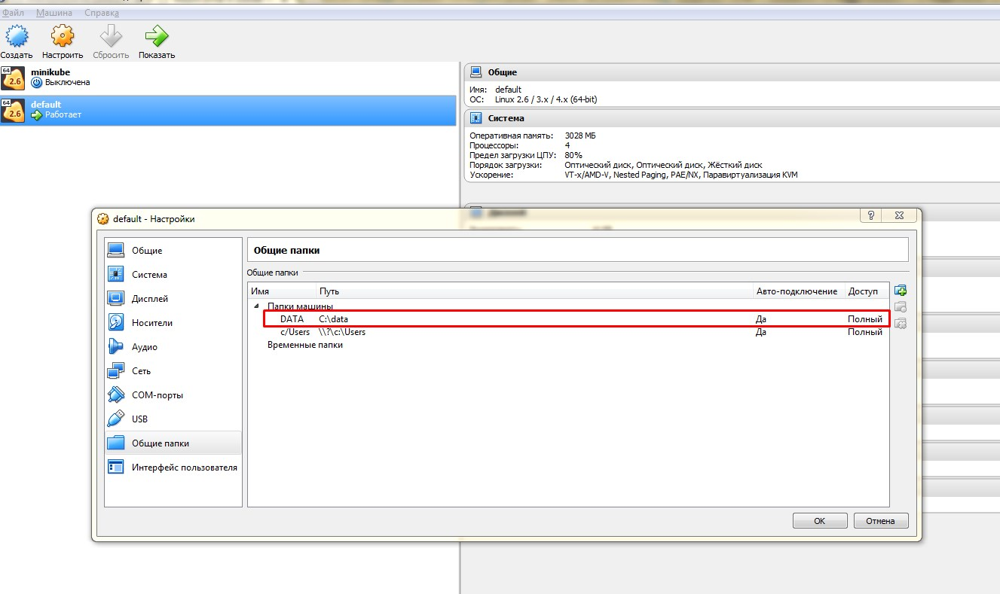
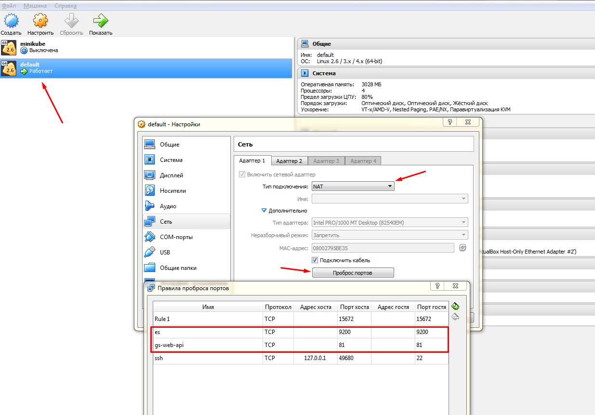

IMPORTANT: Не рекомендуется использовать docker на *WINDOWS*, или *MAC OS*, для production среды. Используйте *LINUX OS*. 

include::../../guthub-files.adoc[]

include::../../hardware-requirements.adoc[]

== Инструкция по разворачиванию на WINDOWS (VirtualBox)

== Необходимые зависимости:

Для разворачивания компонентов глобального поиска вам потребуется установить Docker Toolbox на WINDOWS:

* https://docs.docker.com/toolbox/toolbox_install_windows//[Установка Docker Toolbox]
* Запустить Docker Quickstart Terminal. При этом будет добавлен образ в VirtualBox. Также будут добавлены переменные Windows, которые позволяют работать с Docker из командной строки Windows (cmd).

TIP: Для проверки версии установленого docker запустите команду: `` docker --version `` внутри `Docker Quickstart Terminal`

* в cmd.exe запустите команду `docker-machine ssh default`. Этой командой произойдет вход в linux os, на которой утсановлен docker.
* Дальше выполните команду `sysctl vm.max_map_count=262144`

include::../../gs-components-descriptions.adoc[]

== Настройка переменных контейнеров

Все контейнеры компонентов глобального поиска конфигурируются из файла с переменными среды (_environment variables_)
* Базовый файл с переменными - *Docker\win\default-env*

=== Укажите значения таким переменным, изменив файл _Docker\win\default-env_

TIP: Для bpm’online приложений использующих ORACLE БД необходимо изменить переменную `GS_WORKER_DB_CONNECTION_STRING_PATTERN` в файле _Docker\win\oracle-env_

include::../../environments.adoc[]

** В файле _Docker\win\mysql-env_ змените строку подключения к mysql `GS_DB_CONNECTION_STRING`, только если у вас отдельно развернут mysql
*** server=gs-mysql - хост
*** user id=$MYSQL_USER - пользователь
*** pwd=$MYSQL_PASSWORD - пароль

== Создайте папку C:\data

* Сделайте общую папку `DATA`, в настройках VirtualBox (http://moderndev.net/mount-drive-docker-windows/[статья]);



* Сделать папку внутри Docker и смонтировать ее:
** `docker-machine ssh default`
** `sudo mkdir /data`
** `sudo mount -t vboxsf DATA /data`
* В файле `Docker\win\default-env.bat` Заменить `C:\\data` на `/data` для
** GLOBALSEARCH_VOLUME
** ES1_VOLUME
** ES2_VOLUME
** RABBITMQ_VOLUME
** MYSQL_VOLUME
* Создайте такие папки внутри папки C:\data
** `es1`
** `es2`
** `rabbitmq`
** `mysql`
** `globalsearch`

== Удалить такие строчки:

* В `Docker\mysql\run.bat` `-v %MYSQL_VOLUME%:/var/lib/mysql ^`
* В `Docker\rabbitmq\run.bat` `-v %RABBITMQ_VOLUME%:/var/lib/mnesia ^`

TIP: Для `docker windows toolbox` не поддерживается сохраение данных в `mysql` и `rabbitmq` при перезапуске контейнов.

== Запуск контейнеров

include::../../ports-bindings.adoc[]

Скопируйте папку Docker из дистрибутива на windows машину и запустите команду:

Для MSSQL приложения::
```
Docker\win\run.bat mysql mssql 1.0
```

Для Oracle приложения::
```
Docker\win\run.bat mysql oracle 1.0
```

== Пробросить порты для virtualbox 

* Пробросить `81` порт 
* Пробросить `9200` порт



== После успешного запуска контейнеров будут автоматически смонтированы docker volumes:

include::../../volumes.adoc[]

TIP: В случае падения одного из контейнеров *elasticsearch*, данные будут сохранятся на внешнем диске, из вне docker контейнера. https://docs.docker.com/storage/volumes/[Подробнее о docker volumes]. 

include::../../check-after-run.adoc[]

include::../../logging.adoc[]

include::../../enabled-gs-in-bpm.adoc[]